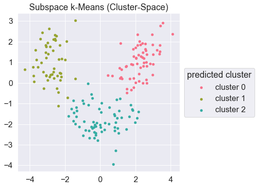
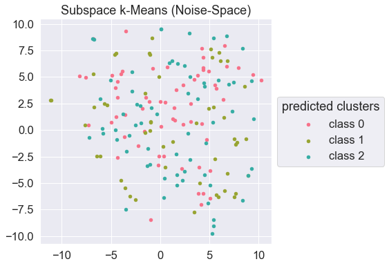

SubspaceKMeans
==============

Mautz, Dominik, et al. "Towards an Optimal Subspace for K-Means." Proceedings of the 23rd ACM SIGKDD International Conference on Knowledge Discovery and Data Mining. ACM, 2017. ([link](https://dl.acm.org/doi/10.1145/3097983.3097989))

Original implementation of above article.

This package provides `SubspaceKMeans` class which implements the above algorithm and act like the `KMeans` of scikit-learn (sklearn.cluster.KMeans).

## Install

`> pip install "git+https://github.com/tetutaro/subspacekmeans"`

## Very simple usage

```
from subspacekmeans import SubspaceKMeans

subspace_km = SubspaceKMeans(n_clusters=8)
predicted = subspace_km.fit_predict(data)
transformed = subspace_km.transform(data)
```

## Notices

- This implementation is now based on `scikit-learn==0.24.1`
- This implementation does not support sparse matrix as input data
- This implementation does not use either Cython nor algorithms which adopted by scikit-learn (`lloyd` and `elkan`)
    - just use numpy
    - easy to understand but slow

## Detailed usage

- comparing Subspace k-Means with PCA + k-Means. see [wine.ipynb](ipynb/wine.ipynb)
- finding the best $k$ of (Subspace) $k$-Means. see [pendigits.ipynb](ipynb/pendigits.ipynb)

## Sample



