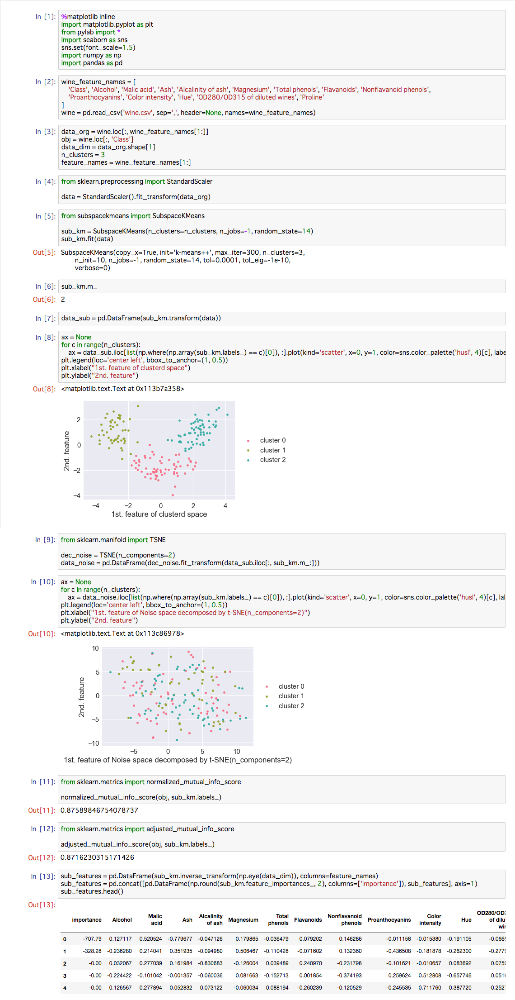

SubspaceKMeans
==============

Mautz, Dominik, et al. "Towards an Optimal Subspace for K-Means." Proceedings of the 23rd ACM SIGKDD International Conference on Knowledge Discovery and Data Mining. ACM, 2017.

Original implementation of above article.

NOTICE: SubspaceKMeans does not support sparse matrix

INSTALL: `> pip install git+https://github.com/tetutaro/subspacekmeans`

### Usage

